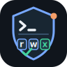

<p align="center">
  
</p>

# Bash Guard

<p align="center">
  
  
  
  
  
</p>

[English](README.md) · [权限策略](https://github.com/lloydzhou/bash-agent/blob/main/docs/bash-tool-policy.md) · [发布页](https://github.com/lloydzhou/claude-bash-guard/releases) · [Homebrew Tap](https://github.com/lloydzhou/homebrew-tap)

**面向 Claude Code 的失败关闭 Bash 安全闸门。** Bash Guard 会在每次 Claude Code 调用 `Bash` 工具前检查命令；即使启用 `bypassPermissions` 或 `--dangerously-skip-permissions`，检查仍会执行。

```bash
brew tap lloydzhou/tap
brew install bash-guard
bash-guard claude register --scope user
```

注册后检查状态：

```bash
bash-guard claude status
```

## 为什么使用 Bash Guard

- **绕过权限时依然生效。** `PreToolUse` Hook 早于 Claude Code 的权限判定执行。
- **失败关闭。** 二进制缺失、Hook 输入无效或审计写入失败时，都会拒绝 Bash 调用，绝不静默放行。
- **运行痕迹极小。** 注册只生成极小的本地 Claude Code 插件适配器，记录二进制路径，不复制二进制。
- **按需审计。** 可选的 JSONL 审计日志记录每次判定、命令、调用方工作目录与所需权限。
- **策略语义一致。** 命令分类和拒绝文案与 Bash Agent 使用同一份 Rust 策略实现。

## 三步开始

### 一、安装

通过 Homebrew：

```bash
brew tap lloydzhou/tap
brew install bash-guard
```

也可以从 [GitHub 发布页](https://github.com/lloydzhou/claude-bash-guard/releases) 下载对应平台的压缩包。

### 二、注册到 Claude Code

```bash
bash-guard claude register --scope user
```

可用作用域为 `user`、`project`、`local`，默认是 `user`。注册会调用 Claude Code 官方插件命令，添加本地 Marketplace 并安装适配器。

### 三、检查状态

```bash
bash-guard claude status
```

随后按常规方式启动 Claude Code。已注册作用域内的每个 `Bash` 工具调用都会自动经过 Bash Guard。

## 配置权限与审计日志

默认权限模式为 `0467`。权限位含义、命令分类、推荐模式及完整示例请查看 [Bash 工具权限策略](https://github.com/lloydzhou/bash-agent/blob/main/docs/bash-tool-policy.md)。

仅为新启动的 Claude Code 进程设置权限模式：

```bash
BASH_GUARD_MODE=4447 claude
```

无效的权限模式会按 `0000` 失败关闭处理。

审计日志**默认关闭**。请在启动 Claude Code 前设置非空日志路径：

```bash
export BASH_GUARD_AUDIT_LOG="$HOME/.claude/bash-guard-audit.jsonl"
claude
tail -f "$BASH_GUARD_AUDIT_LOG"
```

日志每行是一条 JSON 记录。`cwd` 是 Claude Code 为该工具调用提供的工作目录，用于识别命令从哪个项目发起，**并不是**命令实际访问的目标路径。若日志目录无法创建、日志无法写入或同步，Bash Guard 会拒绝该命令。

典型的策略拒绝信息：

```text
command blocked by bash safety policy (required=4000 allowed=0467; mode=system/external/network/workspace bits=4:read,2:write,1:execute)
```

## 注册管理

```bash
# 取消 Claude Code 集成。
bash-guard claude unregister --scope user

# 如有需要，再卸载 Homebrew 软件包。
brew uninstall bash-guard
```

自动化或非标准安装可使用以下环境变量：

- `BASH_GUARD_BINARY`：覆盖注册时记录的二进制路径。
- `BASH_GUARD_STATE_DIR`：覆盖注册目录；默认是 `~/.claude/bash-guard`。

## 安全边界

Bash Guard 仅保护由 Claude Code 发起的 `Bash` 工具调用。拥有主机控制权的用户仍可直接执行系统命令、修改自己的 Claude Code 安装，或移除用户级插件。

如需组织级强制策略，管理员应通过受管 Claude Code 设置限制 Marketplace 来源、配置可信 Marketplace、强制启用插件，并在适用时禁止侧载插件。

## 本地开发

```bash
cargo fmt --check
cargo test
cargo build --release

printf '%s' '{"hook_event_name":"PreToolUse","tool_name":"Bash","cwd":"/tmp/project","tool_input":{"command":"cat README.md"}}' \
  ./target/debug/bash-guard claude hook
```

直接测试仓库适配器前，先构建二进制，并将 `bash-guard` 放入 `PATH`，或设置 `BASH_GUARD_BINARY`：

```bash
BASH_GUARD_BINARY="$PWD/target/debug/bash-guard" claude --plugin-dir ./plugins/bash-guard
claude plugin validate ./plugins/bash-guard
claude plugin validate .
```

## 项目结构

```text
src/
├── main.rs       # Hook 协议、审计、注册与状态管理
└── policy.rs     # 与 Bash Agent 对齐的权限分类
plugins/bash-guard/
└── scripts/bash-guard  # 仅负责失败关闭启动二进制
```

采用 [MIT 许可证](LICENSE)。
